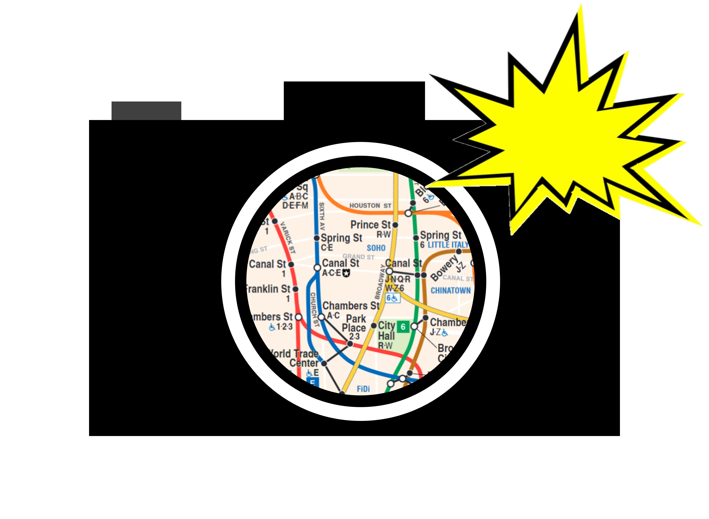

<h1 align=center> 
      nyc-subway-tracker 
</h1>

A program that logs the history of the subway train arrival time predictions from https://new.mta.info/.
This program can be used to predict the delay between any train service for any station at any time.

# Installation
## Download Release
Please see the releases section on the right side of the page to download an official release. The only release provided was built for amd64 Windows. Please see the build instructions below if you want to build/run the code from another environment.

## Build from source
1. Clone the repository from GitHub.
2. Initialize the submodules using git submodule update --init
3. Build libcurl using the curl repository submodule by following the instructions in the GIT-INFO within the repo. Note that autoconf (with m4), automake, libtools, and make is needed to build libcurl. If on macOS with homebrew, install openssl with brew and use the --with-openssl=/opt/homebrew/opt/openssl option when running the configure file.
4. Build sqlite by renaming Makefile.linux-gcc to Makefile, making any changes in the makefile necessary to suit your environment, and running make. If on windows, make sure to change the EXE variable. If not on windows, then no change is usually needed. Alternatively, create a build folder as a child of the sqlite repo and follow the build instructions for Unix systems provided in the README for sqlite.
5. Run the Makefile in the parent directory of the nyc-subway-tracker repository.

- pugixml is built in the nyc-subway-tracker Makefile. nlohmann's json does not need to be separately compiled.

# Usage
work in progress

# Notes 
work in progress

# Why?
The data from this tool can be used to find the time between trains for a station that you are planning to visit.
If the data shows that the station has a long delay for a train service that you need (e.g. 15 min delay), you can
know to be more proactive with checking the subway status to avoid being stuck in the station for a while.

# License
Licensed by the [MIT License](https://github.com/molofgarb/nyc-subway-tracker/blob/main/LICENSE).

# Credits
curl team for libcurl for getting web pages.

nhohmann for their JSON for Modern C++ project for providing a library to parse .json files.

zeux for their pugixml project for providing a library to parse .xml files.

The SQLite team for the SQLite project to use for working with an SQLite database.

The MTA for providing real-time subway arrival times.

[curl](https://github.com/curl/curl)

[JSON for Modern C++](https://github.com/nlohmann/json)

[pugixml](https://github.com/zeux/pugixml)

[SQLite](https://www.sqlite.org/index.html)

[MTA](https://new.mta.info/)
