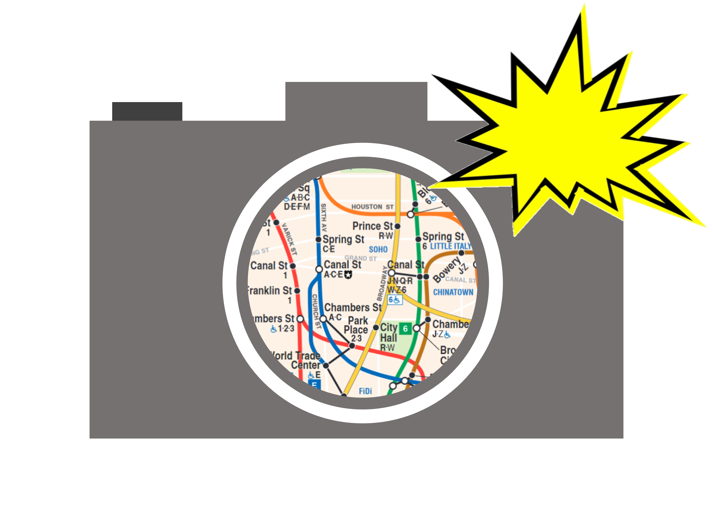
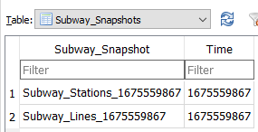
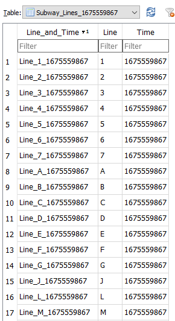
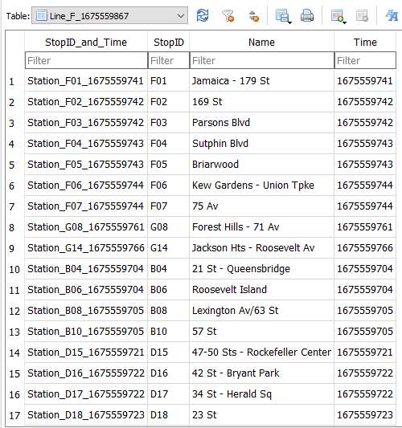
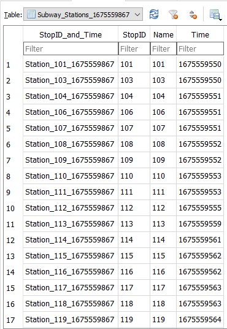
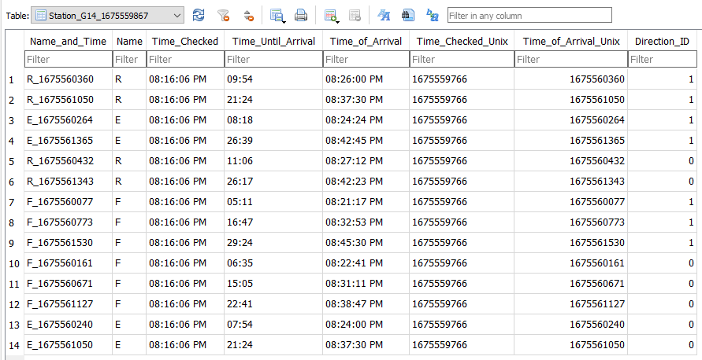

<h1 align=center> 
      nyc-subway-tracker 
</h1>

A program that logs the history of the subway train arrival time predictions from the MTA API, which can be found on https://new.mta.info/.
This program can be used to predict the delay between any train service for any station at any time.

# Installation
## Download Release
Please see the releases section on the right side of the page to download an official release. The only release provided was built for x86_64 Windows. Please see the build instructions below if you want to build/run the code from another environment.

After both data logging and browsing portions of the program have been completed, binaries will be provided for M1 macOS, ARM Linux, and x86_64 Linux since can compile C++ in those environments.

## Build from Source
1. Clone the repository from GitHub.
2. Initialize the submodules using `git submodule update --init --recursive`
3. Run the Makefile in the parent directory (in the directory, run `make`) of the nyc-subway-tracker repository. The makefile will build the external libraries if necessary.

- You will need make, autotools, libtool, and the previous three programs' dependencies to build the external libraries from source.
    - `make clean` removes object files, `make cleaner` removes object files and binaries, `make cleandb` deletes the database file generated by the logger, and `make remake` removes all build and binary files and rebuilds the binaries.

# Usage
## Subway Snapshot Examples
The following figures show examples of the data stored in the SQLite database collected by the data logger. There is no interface to view the data yet, so the data was observed using the "DB Browser for SQLite" program. This program is available on Windows (x86 and x86_64), macOS (M1 and x86_64), and Linux (x86_64).

Fig. 1. shows the root table of the database, which keeps all snapshots taken by the logger. A station-based and line-based snapshot are taken.

     
    Fig. 1. Snapshots Table

Fig. 2. shows a line-based snapshot table. This snapshot stores the names and metadata for all lines in the subway system when the system was last checked.

     
    Fig. 2. Subway-Stations Table

Fig. 3. shows a line table. This table stores the names and metadata for all stations in the subway line when the subway system was last checked.

     
    Fig. 3. Snapshots Table

Fig. 4. shows a station-based snapshot table. This snapshot stores the names and metadata for all stations in the subway system when the system was last checked.

     
    Fig. 4. Snapshots Table

Fig. 5. shows a station table. This table stores the arrival times and metadata for all subway trains that are known to be heading toward the station when the station was last checked.

     
    Fig. 5. Stations Table

# Notes 
- The data logger portion of the program is mostly finished. The current plan for browsing and analyzing data in the database is through a command-line-based interface that allows you to traverse entries in a tree-like manner, where the snapshot table is the root station tables are the leaves. The data logger and data browser portions of the program will be two separate executables.

- Note that a direction ID of 1 generally means that the train is heading in a north-ish direction and 0 means that the train is heading in a south-ish direction.

# Why?
The data from this tool can be used to find the time between trains for a station that you are planning to visit. If the data shows that the station has a long delay for a train service that you need (e.g. 15 min delay), you can know to be more proactive with checking the subway status to avoid being stuck in the station for a while.

Also, I wanted an excuse to learn how to work with SQL, specifically SQLite.

# License
Licensed by the [MIT License](https://github.com/molofgarb/nyc-subway-tracker/blob/main/LICENSE).

# Credits
curl team for [curl/libcurl](https://github.com/curl/curl) -> helps me get web pages.

nhohmann for their [JSON for Modern C++ project](https://github.com/nlohmann/json) -> helps me parse .json files.

zeux for their [pugixml](https://github.com/zeux/pugixml) project -> helps me parse .xml files.

The SQLite team for the [SQLite](https://www.sqlite.org/index.html) project -> lets be read/write data to a database.

The [MTA](https://new.mta.info/) for providing real-time subway arrival times.